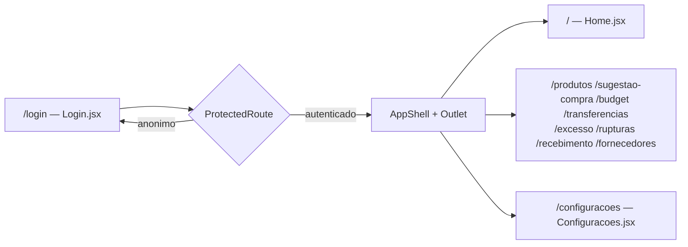
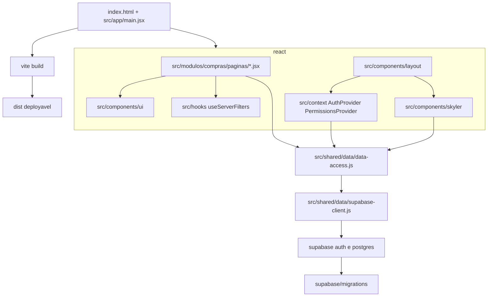

# arquitetura e navegacao do dashboard compras

## fluxo de navegacao (react-router-dom, `src/app/App.jsx`)



- `ProtectedRoute` (`src/app/ProtectedRoute.jsx`) decide entre `Navigate` para `/login` (sem sessao) ou montar `PermissionsProvider` + `AppShell` (com sessao);
- `AppShell` renderiza a sidebar/drawer e o `<Outlet/>` do react-router-dom com a tela ativa;
- `index.html` (raiz do repositorio) e o unico entrypoint HTML do build: carrega `src/app/main.jsx`, que monta `<App/>` em `#root`. nao existe mais um html por tela.

## arquitetura de arquivos



## responsabilidades

| caminho                                      | responsabilidade                                                                 |
| -------------------------------------------- | -------------------------------------------------------------------------------- |
| `src/app/index.css`                          | tema daisyUI `compras` + tokens extras, design system e estilos globais          |
| `src/app/App.jsx`                            | rotas da aplicacao (react-router-dom)                                            |
| `src/app/main.jsx`                           | entrypoint do vite, monta `<App/>`, liga o MSW em dev quando `VITE_USE_MSW=true` |
| `src/shared/context/AuthProvider.jsx`        | sessao, login, logout e perfil                                                   |
| `src/shared/context/PermissionsProvider.jsx` | catalogo de modulos/graficos e enforcement de permissao                          |
| `src/shared/data/supabase-client.js`         | instancia tecnica do SDK, usada somente pela camada de dados                     |
| `src/shared/data/data-access.js`             | fachada unica para RPCs, auth, usuarios, permissoes e parametros                 |
| `src/shared/hooks/useServerFilters.js`       | estado de filtros/ordenacao/paginacao resolvidos no servidor                     |
| `src/shared/layout/`                         | `AppShell` (sidebar/drawer) e `ProtectedRoute` (guarda de autenticacao)          |
| `src/shared/ui/`                             | kpi, filtro, paginacao e graficos reutilizados pelas telas                       |
| `src/modulos/compras/paginas/*.jsx`          | regra de cada tela de negocio                                                    |
| `mocks/handlers.js`                          | respostas MSW para as RPCs de dashboard, uso exclusivo em dev local              |
| `supabase/migrations/`                       | fonte executavel do schema e das RPCs atuais                                     |
| `supabase/sql/`                              | historico e copias numeradas, **nao executar**                                   |
| `src/modulos/compras/tours/`                 | `criarTour`/`useTourAutomatico` e um arquivo de steps por tela                   |

## regra de dependencia

```text
pages/context/skyler -> data-access
data-access          -> supabase-client
supabase-client      -> sdk npm
```

Somente `data-access.js` conhece o SDK e o schema remoto. Componentes de `components/ui/` nao devem importar dados diretamente (recebem props das paginas) e a camada de dados nao deve importar UI, evitando dependencia circular.

## estrutura de documentacao

```text
docs/
├── ai/
├── architecture/
├── audits/
├── integration/
├── operations/
├── reference/
└── data-contracts/
```

## legado pre-React (removido)

A versao anterior do produto — multi-pagina e vanilla js — vivia em `src/js/`, `src/assets/css/styles.css` e nos `*.html` de `src/`, empacotada por `scripts/build.js` (esbuild). Tudo isso foi **removido do repositorio**: a funcionalidade ja estava portada para o app React e nada daquela arvore entrava no build.

`npm run build` (`vite build`) e `npm run dev` processam somente o `index.html` da raiz do repositorio. `npm run validate` falha se `src/js/`, `src/assets/`, `scripts/build.js` ou qualquer HTML dentro de `src/` reaparecer.

O historico continua acessivel pelo git. Documentos escritos antes dessa remocao trazem um aviso no topo e valem como registro datado, nao como instrucao.
